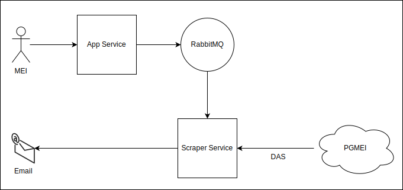

# Scraper Service - Dev Challenge

This project is part of a solution for a Dev Challenge that consists of creating a system to allow MEIs to receive their DAS directly by email.

The entire solution systems include:  
 
- [**App Service**](https://github.com/sesaquecruz/dev-challenge-app-service): Provides a REST API to receive MEI and DAS information. The received data is then forwarded to the Scraper Service through RabbitMQ.
- **Scraper Service**: Retrieves the data from RabbitMQ, scrapes the DAS from the PGMEI site, and then sends it by email.

## Diagram



## Messaging

### Data Format

- From RabbitMQ queue `email.das.queue`:

```
{
  "mei": {
    "cnpj": "66.516.671/0001-18",
    "email": "user@mail.com"
  },
  "das": {
    "year": 2024,
    "month": 1
  }
}
```

## Installation

### Using only Docker Images

1. Download the file [docker-compose-demo.yml](./docker-compose-demo.yml).

2. Navigate to the directory containing `docker-compose-demo.yml`.

3. Run the docker compose to start the services:

```
docker compose -f docker-compose-demo.yml up -d
```

To stop all services, run: `docker compose -f docker-compose-demo.yml down`.

### Cloning the Repository

1. Clone this repository:

```
git clone https://github.com/sesaquecruz/dev-challenge-scraper-service
```

2. Enter the project directory:

```
cd dev-challenge-scraper-service
```

3. Run the docker compose to start the infrastructure services:

```
docker compose --profile infra up -d
```

4. Run the docker compose to start the application service:

```
docker compose --profile prod up -d --build
```

To stop all services, run: `docker compose --profile infra --profile prod down`.

## Usage

1. Access the App Service to send the DAS information:

```
http://localhost:8080/api/v1/docs/
```

2. Access the Email Server to visualize emails received:

```
http://localhost:1080/
```

The RabbitMQ exchanges and queues can be accessed at `http://localhost:15672/`. Use `guest` as the username and password.

## Contributing

Contributions are welcome! If you find a bug or would like to suggest an enhancement, please make a fork, create a new branch with the bugfix or feature, and submit a pull request.

## License

This project is licensed under the MIT License. See [LICENSE](./LICENSE) file for more information.
